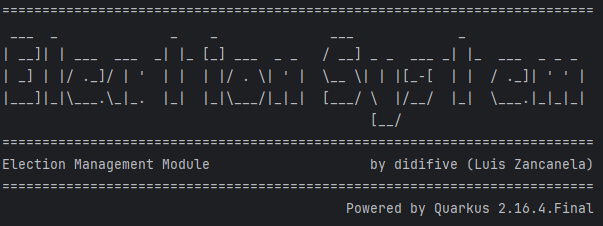
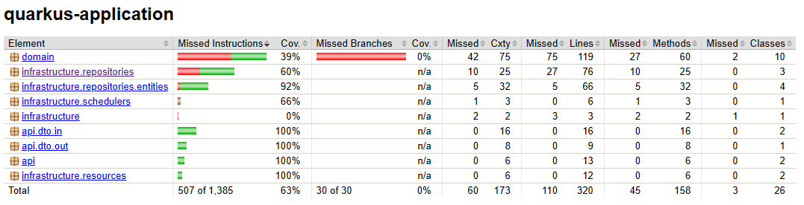
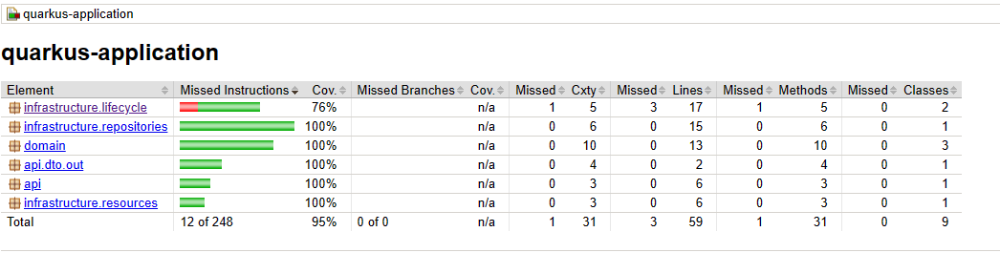
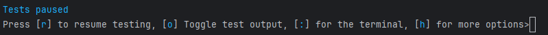
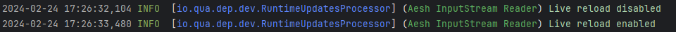
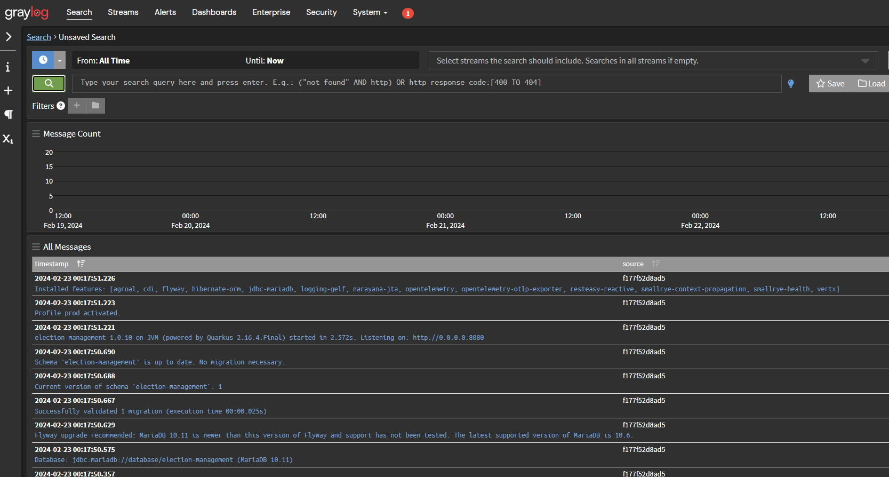
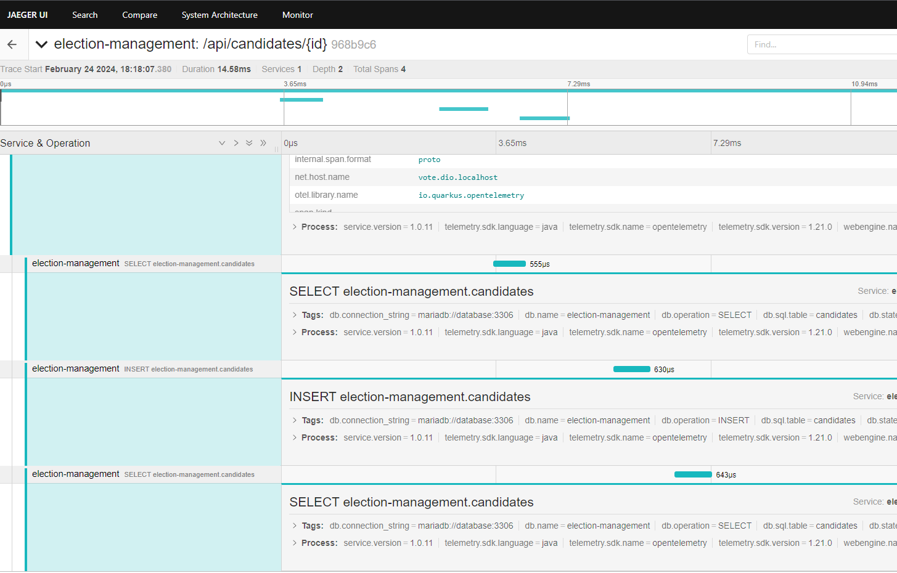
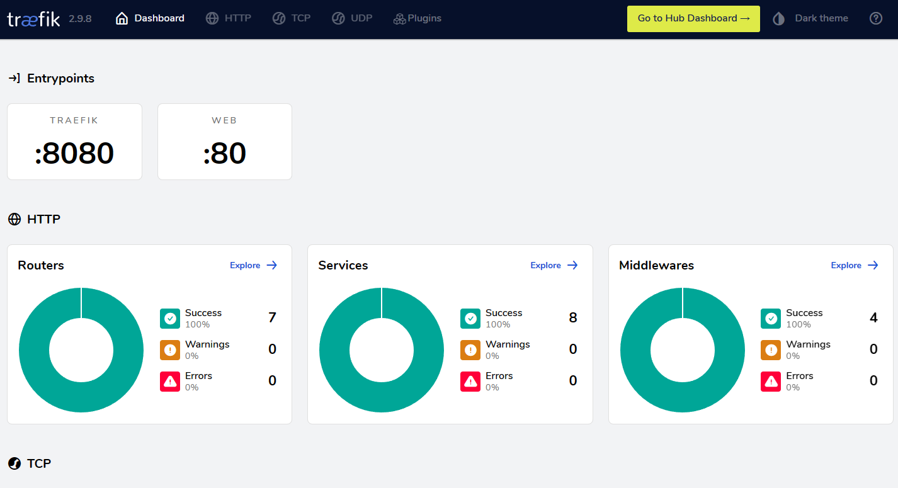

# Sistema de Eleição com Java e Quarkus

## 🎯 Objetivo

O objetivo deste projeto é criar um sistema distribuído e escalável para eleições, 
contendo aplicações responsáveis para votação, gerenciamento de eleição, 
e consulta de resultados utilizando Java, Docker, MariaDB, Quarkus e Arquitetura Cebola.

Este projeto conta com 3 módulos:
- [Election Management]
- [Voting App]
- [Result App]

Projeto de laboratório da [dio.me] com o especialista [Thiago Poiani]

## 📜 Tecnologias

- Linguagem
  - [Java] 17
- Framework
  - [Quarkus]
- Testabilidade
  - [JUnit] 
  - [Testcontainers]
- ORM
  - [Hibernate]
- Migração
  - [Flyway]
- Conteinerização
  - [Docker]
- Tráfego
  - [Traefik]
- Armazenamento
  - [MariaDB]
  - [Redis]
- Observabilidade
  - [Graylog]
  - [OpenSearch]
  - [MongoDB]
  - [Jaeger Tracing]

## 🛠️ Mudanças e Atualizações

Algumas mudanças e atualizações que fiz em relação com o projeto original:

- Banner personalizado do quarkus: 
- No arquivo [cicd-build.sh] foi adicionado comando para fazer com que o script atualize a
versão da aplicação no arquivo [docker-compose.yml], assim quando for utilizar 
o comando docker compose up de uma das aplicações, já irá utilizar a TAG referente à última versão.
- Uso de assertAll para encapsular série de assertEquals.
- Criação de Coleção do Postman para fazer requisições aos endpoints.
- Criado mais testes para Election Management e Voting App e adição do Jacoco para relatório de coverage:
  - Election Management: 
  - Voting App: 


## 🎯 Aplicações

### ⚙ Election Management

A aplicação Election Management encontra-se na pasta `election-management`.  
Readme do [Election Management]


### 📥 Voting App

A aplicação Voting App encontra-se na pasta `voting-app`.  
Readme do [Voting App]

### 🧾 Result App

A aplicação Result App encontra-se na pasta `result-app`.  
Readme do [Result App]


## 🚀 Iniciando as aplicações

### 📦 Docker Compose
Para iniciar as aplicações, antes é importante subir primeira os containers abaixo para montar a infraestrutura, seguem abaixo os comandos a serem executados:

```bash
docker compose up -d reverse-proxy jaeger graylog
docker compose up -d caching database
```

Após o graylog subir, para configurá-lo para protocolo UDP, pode-se usar o comando abaixo ou fazer a requisição com os parâmetros, por exemplo, via postman:
```bash
curl -H "Content-Type: application/json" -H "Authorization: Basic YWRtaW46YWRtaW4=" -H "X-Requested-By: curl" -X POST -v -d '{"title":"udp input","configuration":{"recv_buffer_size":262144,"bind_address":"0.0.0.0","port":12201,"decompress_size_limit":8388608},"type":"org.graylog2.inputs.gelf.udp.GELFUDPInput","global":true}' http://logging.private.dio.localhost/api/system/inputs
```
_Esta configuração para o graylog é necessária somente uma vez._  

## 🎁 CI/CD

### ✅ CI/CD Build
Para as aplicações desenvolvidas, primeiro criar o build para cada aplicação, abaixo existe os comandos para build das três aplicações:
O script para CI/CD Build está no arquivo [cicd-build.sh]

```bash
./cicd-build.sh election-management
./cicd-build.sh voting-app
./cicd-build.sh result-app
```

### 🤖 CI/CD Blue Green Deployment
Com o comando para CI/CD Build, o script já cria a imagem do docker com a versão como TAG. Para realizar um blue green deployment, utilize os comandos abaixo conforme a aplicação:
O script para CI/CD Blue Green Deployment está no arquivo [cicd-blue-green-deployment.sh]
```bash
./cicd-blue-green-deployment.sh election-management 1.0.0
./cicd-blue-green-deployment.sh voting-app 1.0.0
./cicd-blue-green-deployment.sh result-app 1.0.0
```

_Lembre-se de antes de executar o deployment, revisar a versão (TAG) que vem após o nome da aplicação._ 

## 👨‍💻 Utilizando o sistema e recursos

### 📝 DEV
Para executar a aplicação localmente em modo de dev, entre na pasta da aplicação e utilize o comando no terminal:
```bash
quarkus dev
```
Após a aplicação carregar pode-se acessar o painel Dev UI do Quarkus pelo link: http://localhost:8091/q/dev/  
_Atenção para a porta, cada aplicação tem uma definida para execução de dev (para não conflitar com o container do proxy reverso), sendo:_
  - _Porta 8091 para election-management_
  - _Porta 8092 para voting-app_
  - _Porta 8093 para result-app_

Quando a aplicação carrega aparece a seguinte mensagem de "Tests paused":  
  
Para ativar os testes é só teclar o "r". No modo DEV o Quarkus faz uso de Live Reload, ou seja, conforme estiver
editando o código o Quarkus irá recarregar e refazer os testes praticamente em tempo real.  
Para ativar o Live reload basta teclar "l" que será mostrado se o recurso foi habilitado ou desabilitado.  
  
_Observação: Quando algum teste ou funcionalidade não estiver respondendo como esperado basta reiniciar teclando "s" 
para forçar a reinicialização ou então teclar "q" para sair e executar o comando `quarkus dev` novamente._

#### 🔣 Swagger
Quando a aplicação estiver em execução com `quarkus dev` para acessar o Swagger é só abrir o link: http://localhost:8091/q/swagger-ui/ 
_Lembre-se que cada aplicação tem sua respectiva porta conforme descrito anteriormente ou consultando o `application.properties` de cada uma_

### ✔️ Testes
Para executar testes unitários e os testes de integração, dentro da pasta do projeto que deseja testar, utilizar o comando abaixo:
```bash
./mvnw verify -DskipITs=false -Dquarkus.log.handler.gelf.enabled=false -Dquarkus.opentelemetry.enable=false -Dquarkus.datasource.jdbc.driver=org.mariadb.jdbc.Driver
```
Para checar o coverage, dentro da pasta do projeto, procure pelo arquivo `target\jacoco-report\index.html`.  
Abaixo exemplo do Jacoco Report para o Voting Api:  


### 📚 Postman
Neste projeto foi adicionado coleção de Postman para se fazer conexões às APIs.  
O arquivo da coleção está em `postman/Election System.postman_collection.json`

### 👀 Logs
Antes de mais nada, para existir e poder acessar os logs é importante ter o graylog em execução,
como executar pode ser visto em _Docker Compose_ de _Iniciando as aplicações_.  
Para acessar os logs pelo navegador utilize: http://logging.private.dio.localhost.

Login padrão:
- Usuário: admin
- Senha: admin

### 🔢 Telemetria
Para acessar a telemetria coletada, no navegador utilize a url: http://telemetry.private.dio.localhost.

Login padrão:
- Usuário: admin
- Senha: admin

###  Traefik
Para acessar dashboard do Traefik no navegador utilize: http://localhost:8080/


[dio.me]: https://www.dio.me/
[Thiago Poiani]: https://github.com/thpoiani/

[Java]: https://www.java.com/pt-BR/
[Quarkus]: https://quarkus.io/
[Docker]: https://www.docker.com/
[Traefik]: https://doc.traefik.io/traefik/
[MariaDB]: https://mariadb.org/
[Redis]: https://redis.io/
[MongoDB]: https://www.mongodb.com/pt-br
[Graylog]: https://graylog.org/
[OpenSearch]: https://opensearch.org/
[Jaeger Tracing]: https://www.jaegertracing.io/
[JUnit]: https://junit.org/junit5/
[Testcontainers]: https://testcontainers.com/
[Hibernate]: https://hibernate.org/
[Flyway]: https://flywaydb.org/

[Election Management]: https://github.com/didifive/lab-quarkus/blob/main/election-management/README.md
[Voting App]: https://github.com/didifive/lab-quarkus/blob/main/voting-app/README.md
[Result App]: https://github.com/didifive/lab-quarkus/blob/main/result-app/README.md

[docker-compose.yml]: https://github.com/didifive/lab-quarkus/blob/main/docker-compose.yml
[common.yml]: https://github.com/didifive/lab-quarkus/blob/main/common.yml
[cicd-build.sh]: https://github.com/didifive/lab-quarkus/blob/main/cicd-build.sh
[cicd-blue-green-deployment.sh]: https://github.com/didifive/lab-quarkus/blob/main/cicd-blue-green-deployment.sh